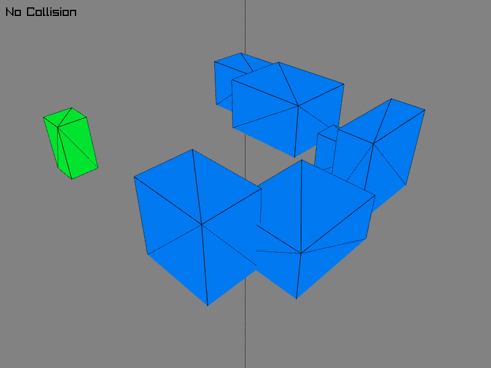

# Raylib 3D collision demo

This aims to be a example of how to implement the Separating axis theorem [(SAT)](https://en.wikipedia.org/wiki/Hyperplane_separation_theorem) collision detection algorithm in C++ using [Raylib](https://github.com/raysan5/raylib)

This is a extracted and modified code from [my other project](https://github.com/LeaoMartelo2/wireframe_game), simplified to be a template / example of 3D collisions in raylib.

(heavily inspired by [this](https://github.com/Trimurdev/Raylib-collision-demo))

## This is in no way the best or most efficient, it's very bare bones and it's only here to serve as example to anyone wanting a template of 3D collisions to work in raylib. 

## Features

 - Collider class

 Gives you a very simple collider class, with the bare minimum to make cuboid Oriented Bounding Boxes.

 - Player class

 Gives you a very bare bones player class, that contains a collider, to move around with `WASD` and `SPACE` to play with the collisions.

 - Gravity

 Very simple gravity system, used to allow for testing walking / jumping on top of colliders;

